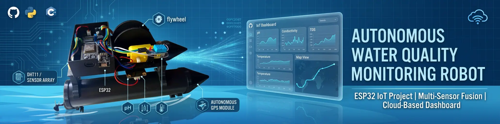
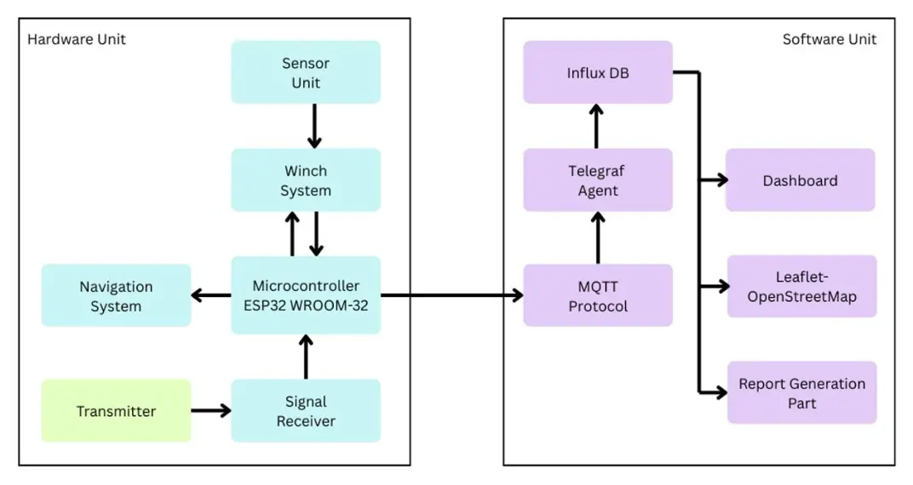
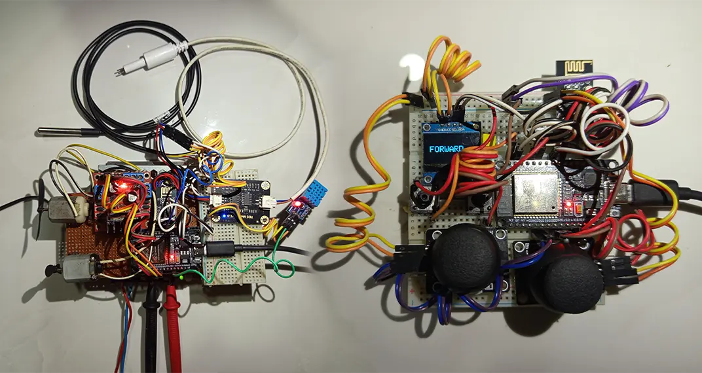
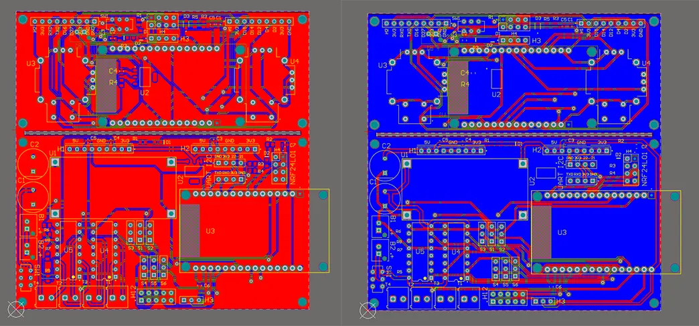
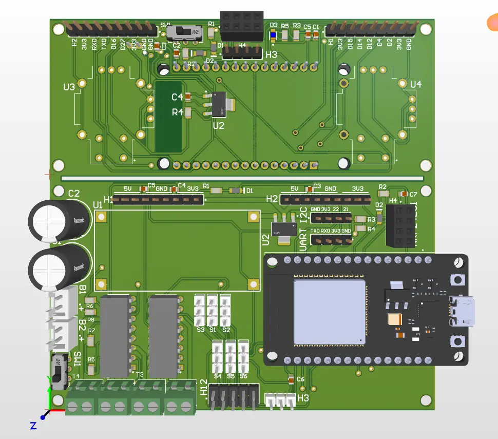
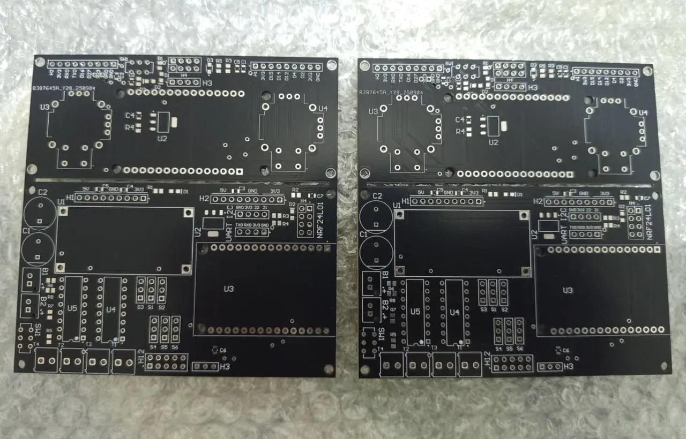
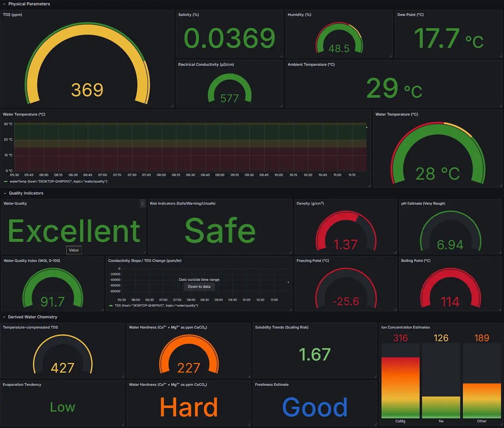

  

<h1 align="center">
Autonomous Portable Water Quality Monitoring Robot
</h1>

An IoT-based autonomous robotic system designed for real-time water quality monitoring and environmental analysis.

---

# Project Overview

Water pollution monitoring is traditionally performed through manual sampling and laboratory testing, which can be time-consuming and expensive.  

This project introduces a **low-cost autonomous robotic system** capable of monitoring water quality parameters in real time and transmitting data to a cloud dashboard.

The robot can automatically collect and analyze environmental data from water bodies and visualize it through an **IoT-based monitoring system**.

This project was developed as a **Final Year Research Project at Wayamba University of Sri Lanka** and was **presented at the ASRITE Research Symposium**.

### Parameters Measured

- Total Dissolved Solids (TDS)
- Water Temperature
- Ambient Humidity
- Electrical Conductivity
- Water Hardness
- Water Quality Index

---

# Complete Robot System

The final system consists of a floating robotic platform equipped with sensors, wireless communication modules, and an IoT dashboard for monitoring environmental data.

---

# System Architecture

The system architecture integrates hardware sensors, wireless communication, cloud data processing, and a real-time dashboard.

### Hardware Components

- ESP32 Microcontroller
- TDS Sensor
- DS18B20 Temperature Sensor
- DHT11 Humidity Sensor
- nRF24L01 Communication Module
- Motorized Depth Winch System

### Software Components

- MQTT Communication
- Telegraf Data Processing
- InfluxDB Time-Series Database
- React.js Web Dashboard
- Grafana Visualization

---

# Mechanical Design (SolidWorks)

The mechanical structure was designed using **SolidWorks** with a **twin catamaran hull design** to provide stability in water.

### Key Mechanical Features

- Twin hull PVC floating structure  
- Lightweight PLA mounting platform  
- Sensor deployment mechanism  
- Integrated motorized winch system  

---

# Circuit Design

A custom electronic circuit was designed to integrate sensors, communication modules, and power management.

### Main Circuit Blocks

- ESP32 control unit  
- Sensor interface circuits  
- Motor driver circuits  
- Wireless communication module  
- Voltage regulation system  

---

# PCB Layout Design

The system includes **two custom PCB boards**:

- **Transmitter Unit PCB**
- **Control Unit PCB**

To reduce fabrication cost and improve manufacturing efficiency, both boards were **panelized into a single PCB fabrication panel**.

### Panelized PCB Layout (Top & Bottom)

The PCB layouts were designed using **Altium Designer**, including optimized routing, ground planes, and sensor interface isolation.

---

# PCB Prototype

Initial system testing was conducted using prototype PCBs to validate:

- Sensor integration
- Communication modules
- Power regulation
- Microcontroller control logic

---

# Fabricated PCB

The final PCB boards were fabricated using **FR4 double-layer boards**, improving durability, signal stability, and compact system integration.

---

# IoT Monitoring Dashboard

The system includes a **real-time IoT dashboard** displaying sensor readings and historical environmental data.

### Dashboard Features

- Live sensor monitoring  
- Historical data visualization  
- Water quality analysis  
- Remote monitoring capability  
- Data logging and reporting  

---

# Live System Demo

The real-time monitoring dashboard for the **Autonomous Water Quality Monitoring System** is deployed online and can be accessed below.

🔗 **Live Dashboard:**  
https://wqc-web.web.app

This dashboard displays real-time sensor data, and water quality analysis collected by the robotic monitoring system.

---

# Key Features

- Autonomous water monitoring robot
- Real-time IoT data transmission
- Depth-based water sampling
- Custom PCB electronics
- Wireless sensor communication
- Cloud-based data visualization

---

# Technologies Used

### Hardware

- ESP32
- nRF24L01
- TDS Sensor
- DS18B20 Temperature Sensor
- DHT11 Sensor

### Software

- Arduino IDE
- MQTT
- Telegraf
- InfluxDB
- React.js
- Grafana

### Design Tools

- SolidWorks
- Altium Designer

---

# Project Report

The complete research documentation for this project is available below.

📄 **Download Full Report**

[Download Final Report](Documents/Final%20Report.pdf)

---

# Academic Information

**University**  
Wayamba University of Sri Lanka

**Degree Program**  
B.Sc. (Joint Major) – Electronics and Computing & Information Systems

**Project Type**  
Final Year Undergraduate Research Project

**Research Presentation**  
Presented at **ASRITE Research Symposium**

**Project Supervisor**  
Eng. S.R.L. Gunawardhana 

---

# Author

**Tharusha Sangeeth**

Electronics & Embedded Systems Developer  
Wayamba University of Sri Lanka

---

# License

This project is released for **educational and research purposes**.
